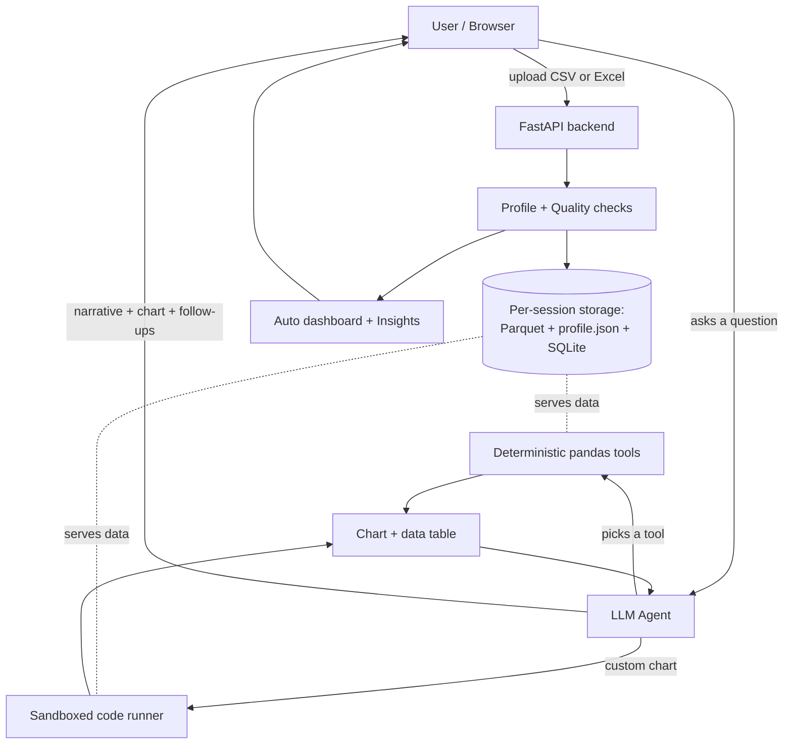
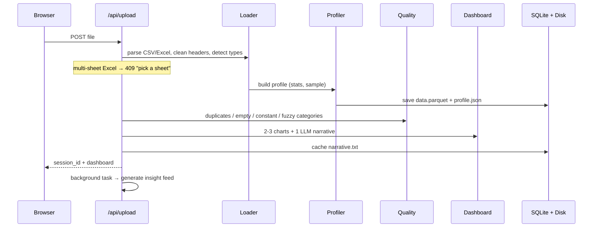
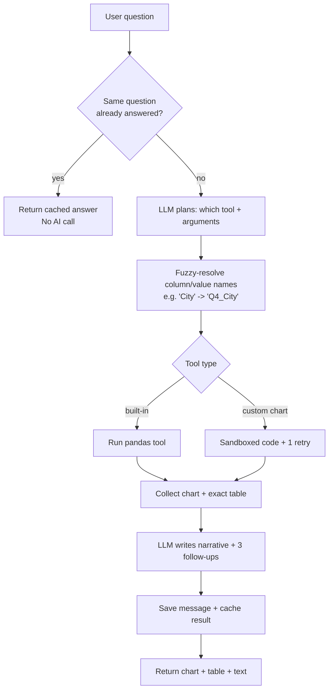
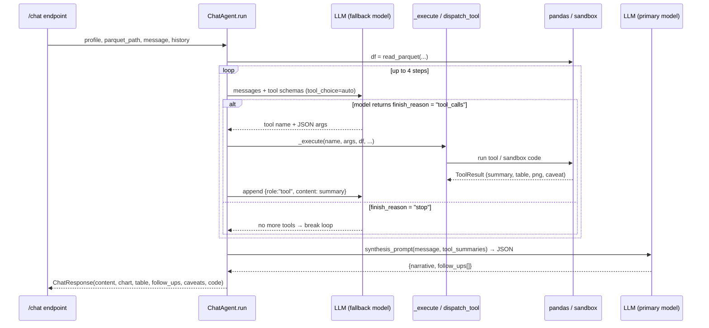

# Survey Analytics — End-to-End System Explainer

**Audience:** Engineering lead, cloud architect, AI lead, and non-technical stakeholders.
**How to read this:** Every section starts with a 🟢 **In plain words** box (no jargon), then a 🔧 **Technical detail** box. Skip whichever you don't need.

---

## 1. What is this product?

🟢 **In plain words**
A person uploads a messy survey spreadsheet (CSV/Excel). The tool instantly gives them a summary dashboard, and then lets them **chat with their data** in plain English — "which city expects the highest price rise?", "draw a pie chart of gender", "compare expectations by age" — and it answers with real numbers and charts. Think of it as a data analyst that never sleeps, sitting on top of your survey file.

🔧 **Technical detail**
A FastAPI (Python) backend + a vanilla JS/HTML/CSS frontend. An LLM (Azure OpenAI) orchestrates a set of **deterministic Python analysis tools**. The LLM decides *what* to compute; the actual numbers are computed by pandas (not guessed by the AI). Charts are rendered with matplotlib. Everything for a survey lives in one "session."

---

## 2. The big picture (one diagram)



🟢 **In plain words:** Upload → the system studies the file and shows a dashboard. Then every question goes to an "AI agent" that chooses the right calculation, runs it on the real data, and returns a chart + a written answer.

---

## 3. The core idea that makes it cheap, fast, and safe

🟢 **In plain words**
We never send the raw survey data to the AI. We send the AI only a **summary** ("here are the columns, their types, and the common values"). The AI uses that to decide what to calculate. The actual calculation runs on our own server against the full data. This means:
- It works the same whether the file has 1,000 rows or 500,000 rows.
- The numbers are always exact (computed by code, not "estimated" by AI).
- It's cheap (small prompts) and private (raw responses stay on our side).

🔧 **Technical detail**
On upload we build a **dataset profile** (JSON): per-column dtype, missing %, unique count, numeric stats, top categorical values, and a ~20-row sample. Only this profile is ever placed in the LLM prompt — token usage stays flat regardless of dataset size. The raw data is stored as **Parquet** on disk and loaded into pandas only when a tool actually runs.

---

## 4. Flow A — Uploading a file

🟢 **In plain words**
You drop in a file. If it's an Excel with multiple tabs, it asks which tab. Then it reads the data, figures out what each column is (number? category? free text?), flags quality problems (duplicates, empty columns, misspelled categories), and builds a dashboard with a few starter charts and a short written summary.

🔧 **Technical detail**



Key decisions made here:
- **Type detection** (`data/loader.py`): numeric / categorical / open-text / datetime, using cardinality and text-length heuristics.
- **One LLM call** for the narrative; everything else is deterministic.
- **Insights** are generated in the background (a sweep of tools ranked by effect size, phrased in one batched LLM call).

---

## 5. Flow B — Asking a question (the heart of the system)

🟢 **In plain words**
You type a question. The AI reads the data summary and your question, then **picks the right tool for the job** — like a manager assigning the right specialist. The specialist (a piece of code) does the math on the real data and produces a chart and a table of exact numbers. The AI then writes a plain-English answer and suggests follow-up questions.

🔧 **Technical detail**



**Decision logic (how the AI picks a tool), from the system prompt:**

| If the user asks… | Tool chosen | What it computes |
|---|---|---|
| "pie chart of X" / "share of X" | `pie_chart` | proportion of each category |
| "bar chart of X" / "distribution of X" | `distribution` | counts (bar) or histogram |
| "compare X by Y" | `crosstab` / `segment_stats` | breakdown across a group |
| "compare expectations by gender/age/…" | `compare_expectations_by_segment` | multi-question scale by segment |
| "show X by A **and** B" | `pivot_table` | two-dimensional grid |
| "which city/state has the highest % of …" | `rank_groups_by_value` | ranked shares, top named |
| "profile of respondents who …" | `filter_profile` | demographic make-up of a subset |
| "exact values entered by respondents who…" | `list_filtered_values` | raw row values |
| "how many selected …" | `threshold_count` / `distribution` | counts |
| "summarise the comments / themes" | `open_text_themes` | themes + sentiment (LLM) |
| anything no tool covers | `generate_code` | custom matplotlib in a sandbox |

🟢 **Why this matters:** the AI's only job is *routing and wording*. The **numbers always come from code**, so answers are trustworthy and reproducible.

---

## 5b. DEEP DIVE — exactly how the agent works (for engineers)

This section is the "weak spot" filled in: the precise mechanics of *what the agent is, what a tool is, and how a turn executes*. All references are to real code in `backend/app/`.

### 5b.1 What "the agent" actually is
The agent is **not** an autonomous loop with memory. It's a single function — `ChatAgent.run()` in `app/llm/agent.py` — that runs **per question** and is **stateless between turns**. Conversation continuity comes from the frontend replaying the last ~20 messages as `history`. Each turn:

1. Builds the message list: `[system_prompt(profile)] + history + [user_message]`.
2. Loads the session's data: `df = pd.read_parquet(parquet_path)` (full data, in-process).
3. Runs a **bounded tool-calling loop** (max 4 steps) against the **fallback/cheap** model.
4. Runs **one synthesis call** against the **primary** model to produce the narrative + follow-ups (as JSON).

### 5b.2 What "a tool" actually is
Two distinct meanings, deliberately kept separate:

- **The LLM-facing tool schema** (`prompts.tool_definitions()`): OpenAI function-calling JSON — name, description, JSON-schema parameters. This is the *menu* the model sees. The model never runs anything; it only emits a structured request like:
  ```json
  {"name": "rank_groups_by_value",
   "arguments": {"group_col": "City", "target_col": "Food Products",
                 "target_value": "price increase more than current rate"}}
  ```
- **The executor** (`tools/registry.py`): the real Python function (`rank_groups_by_value(df, ...)`) that does pandas math and returns a `ToolResult`:
  ```python
  @dataclass
  class ToolResult:
      tool_name: str
      params: dict
      summary: str            # one-line factual result (fed back to the LLM)
      table: list | dict      # exact numbers (shown to the user, NOT recomputed by LLM)
      png_bytes: bytes | None # the chart
      caveat: str | None      # e.g. "smallest group has only 4 respondents"
  ```
The model picks from the *menu*; our code runs the *executor*. **The LLM never sees raw rows and never produces numbers** — it only sees each tool's one-line `summary` (truncated to 2000 chars) as feedback.

### 5b.3 The turn lifecycle, step by step



Key facts an engineer will want:
- **Two model roles per turn.** Planning/tool-selection uses `llm.deployment_fallback` (cheap); synthesis and any code-gen use `llm.deployment_primary`. (`agent.py:62`, `agent.py:103`.)
- **Function-calling, not prompt-parsing.** We pass `tools=tool_definitions(), tool_choice="auto"`. The model's tool requests come back as structured `tool_calls`, parsed with `json.loads(tc.function.arguments)`.
- **Tool results are fed back** as `{"role": "tool", "tool_call_id": ..., "content": summary}` so the model can chain (e.g., run 3 segment stats, then stop). This is what enables open-ended questions ("what's driving low satisfaction?") to do multiple tool calls before synthesizing.
- **The loop is bounded** at `_MAX_STEPS = 4` — a hard cap on tool calls per question (cost/latency guardrail).
- **Only the *last* chart/table is returned** to the UI; all tool `summary`s are accumulated and handed to the synthesis call so the narrative can reference everything found.

### 5b.4 Inside `_execute` — the three dispatch paths
`_execute(name, params, df, parquet_path, profile, message)` routes to one of three handlers:

1. **`open_text_themes`** → calls `analyze_open_text()` (LLM, cheap model, cached per column), renders a themes-bar + sentiment-pie, returns themes table.
2. **`generate_code`** (Tier 2) → `run_code(code, parquet_path)` in the sandbox. **If it fails or produces no chart**, it makes **one** primary-model repair call (`code_gen_prompt` with the traceback), strips code fences, re-runs once. Two failures → friendly error + the code shown.
3. **Everything else** (Tier 1) → `dispatch_tool(df, name, params)` → a `ToolResult`. The PNG is base64'd into the chart; the `table` becomes the user-visible exact-numbers table; the `caveat` is attached.

### 5b.5 Argument resolution (why messy column names still work)
Before any Tier-1 tool runs, `dispatch_tool` calls `_resolve_params()`:
- **Column args** (`group_col`, `target_col`, `column`, `value_cols`, …) → `_resolve_column()`: exact match → whitespace/case-normalized → unique substring → `rapidfuzz` (≥75 score). So `"City"` → `"Q4_City"`, `"Food Products"` → `"Q11_2_Food Products(Q11)"`.
- **Value args** (`target_value`, `filter_value`) for equality matching → `_resolve_value()`: snaps `"price increase more than current"` → the exact label, and `">=16%"` → `">=16 %"` (whitespace-insensitive via `_norm`, which strips *all* whitespace).
This is the layer that makes the LLM's "good enough" guesses resolve to real schema, and it's pure code (no extra LLM calls).

### 5b.6 The sandbox (Tier 2 internals)
`app/sandbox/`:
- **Static check first** (`ast_check.py`): parse the code to an AST; reject any import outside `{pandas, numpy, matplotlib, seaborn, plotly, math, time}`, any name in `{os, sys, open, eval, exec, __import__, …}`, and any dunder attribute access. Fail-closed before execution.
- **Isolated execution** (`runner.py`): a separate `multiprocessing.Process` with a `Pipe`; on Linux it sets `RLIMIT_CPU` (10s) and `RLIMIT_AS` (512 MB); a 15s wall-clock `poll` then `terminate()` as a hard stop. The child loads the Parquet itself and exposes `df, pd, np, plt, io`; the contract is that the code assigns `result_png` / `result_plotly` / `result_summary`.

### 5b.7 Worked example — "which city has the highest % expecting food price increases?"
1. Planning model emits a tool call: `rank_groups_by_value(group_col="City", target_col="Food Products", target_value="price increase more than current rate")`.
2. `_resolve_params` rewrites → `group_col="Q4_City"`, `target_col="Q11_2_Food Products(Q11)"`, value snapped to the exact label.
3. Executor computes per-city share, drops groups with n<5, sorts → `ToolResult(summary="… 'Chennai' at 60.0% (3/5) …", table=[…per-city rows…], png=…)`.
4. Loop sees the model `stop`; synthesis (primary model) turns the `summary` into a sentence + 3 follow-ups.
5. Endpoint returns chart + exact table + narrative, persists the assistant message, and writes the question cache.

**The number "60% (3/5)" is computed in pandas — the LLM only worded it.** That is the central correctness guarantee of the whole system.

---

## 6. The two "tiers" of analysis

🟢 **In plain words**
Most questions are handled by ready-made calculators (instant, free, exact). Only unusual chart requests fall back to letting the AI **write a small program**, which we run in a locked-down sandbox so it can't do anything dangerous.

🔧 **Technical detail**
- **Tier 1 — built-in tools** (`tools/registry.py`): pure pandas/matplotlib functions. No LLM cost, deterministic, return a chart + a structured table + low-sample caveats.
- **Tier 2 — sandboxed code-gen** (`sandbox/`): the primary LLM writes Python; before running, an **AST whitelist** rejects imports/`os`/`open`/dunders; execution happens in a separate process with **CPU/memory/time limits**. On failure, it auto-retries once with the error fed back, then gives a friendly message.

---

## 7. How we made it correct for *real* surveys

🟢 **In plain words**
Real surveys are messy: column names like `Q11_2_Food Products(Q11)`, values like `>=16 %` with stray spaces, ages as raw numbers. We added smarts so that when someone says "Food Products" or "City," the system maps it to the right messy column, and matches values even if spacing differs. We validated the answers against a survey that came **with an official answer key** — and they matched exactly.

🔧 **Technical detail**
- **Fuzzy resolution** (`dispatch_tool`): friendly names → real columns (exact → normalized → substring → rapidfuzz), and approximate values → real response labels.
- **Whitespace-insensitive matching** for values (`>=16 %` == `>=16%`).
- **`min_n` rule** for rankings (ignore tiny groups, default n≥5) — matching the survey's own methodology.
- **Auto-binning** of continuous numerics (e.g. age) into ranges.
- **Nothing is hardcoded** to any specific survey — scales and labels are detected from the data.
- Verified Q1/Q2/Q6/Q7/Q11 against the file's expected-answer sheet (exact match).

---

## 8. Supporting features

| Feature | 🟢 Plain words | 🔧 Technical |
|---|---|---|
| **Dashboard** | Auto summary + starter charts + quality card + column overview | Deterministic charts + cached narrative + quality flags + column_summary |
| **Insight feed** | "Here are the interesting things we found" | Background tool sweep ranked by effect size, one batched LLM call |
| **Compare mode** | Compare two surveys ("what changed?") | Profile diff + agent gets the diff summary |
| **Open-text analysis** | Themes + sentiment from free-text answers | Sampled, cheap-model, cached per column |
| **Question caching** | Same question = instant, no AI cost | Disk cache keyed by data version + normalized question |
| **Chart zoom** | Expand a chart and zoom/pan | Canvas panel with wheel-zoom + pan |
| **PDF export** | Download a report | Pinned charts + insights → PDF |

---

## 8b. Feature → where it comes from (codebase map)

🟢 **In plain words:** this table tells anyone exactly which file does what, so a reviewer can jump straight to the code behind any feature.

🔧 **Technical detail** — paths are under `backend/app/` unless noted.

| Feature / capability | Frontend | API route (`api/`) | Core logic | Notes |
|---|---|---|---|---|
| **File upload + sheet pick** | `frontend/app.js` (`uploadFile`, sheet picker) | `upload.py` (`/upload`, `/upload/sheet`) | `data/loader.py` | Multi-sheet Excel → HTTP 409 with sheet names |
| **Type detection** (numeric/categorical/open-text/datetime) | — | — | `data/loader.py` (`detect_column_type`) | cardinality + text-length heuristics |
| **Dataset profile** (stats, sample) | — | — | `data/profiler.py` (`build_profile`, `load_profile`) | written to `profile.json`; only thing sent to LLM |
| **Data-quality flags** | dashboard render in `app.js` | served via `dashboard.py` | `data/quality.py` (`check_quality`) | duplicates, empty/constant cols, fuzzy categories (rapidfuzz) |
| **Auto dashboard** (cards, charts, narrative) | `app.js` (`renderDashboard`) | `dashboard.py` (`/sessions/{id}/dashboard`) | `dashboard/charts.py`, `dashboard/generator.py` | narrative cached as `narrative.txt` |
| **Insight feed** | `app.js` (dashboard) | `insights.py` (`/sessions/{id}/insights`) | `insights/generator.py` | background sweep; one batched LLM call |
| **Chat orchestration (the agent)** | `app.js` (`sendMessage`) | `chat.py` (`/sessions/{id}/chat`) | `llm/agent.py` (`ChatAgent.run`) | 4-step tool loop + synthesis |
| **LLM client + model routing** | — | — | `llm/client.py` | `deployment_primary` vs `deployment_fallback` |
| **Prompts + tool schemas** | — | — | `llm/prompts.py` (`chat_system_prompt`, `tool_definitions`, `synthesis_prompt`, `code_gen_prompt`) | the LLM-facing "menu" + routing rules |
| **Tier-1 analysis tools** | rendered as chart+table in `app.js` | via `chat.py` | `tools/registry.py` | see tool list below |
| **Argument fuzzy-resolution** | — | — | `tools/registry.py` (`_resolve_params`, `_resolve_column`, `_resolve_value`, `_norm`) | "City"→"Q4_City", ">=16%"→">=16 %" |
| **Tier-2 sandbox code-gen** | "Show code" toggle in `app.js` | via `chat.py` | `sandbox/ast_check.py`, `sandbox/runner.py` | AST whitelist + multiprocessing rlimits + retry |
| **Deterministic data tables in chat** | `app.js` (`renderTable`) | `chat.py` | `tools/registry.py` (ToolResult.table) | exact numbers, persisted on the message |
| **Open-text themes + sentiment** | chart in `app.js` | via `chat.py` (`open_text_themes`) | `opentext/analyzer.py` + `tools/registry.py` (`render_open_text_chart`) | cheap model, cached per column |
| **Question caching** | transparent | `chat.py` (`_cache_path`, `_read_cache`, `_write_cache`) | disk under `qcache/` | key = data version + normalized question |
| **Pinned charts** | `app.js` (`pinChart`, `unpinChart`) | `chat.py` (`/pins` GET/POST/DELETE) | DB `PinnedChart` + PNG on disk | per-session folder |
| **Chart canvas + zoom/pan** | `app.js` (`openCanvas`, `bindCanvas`, `applyZoom`) + `styles.css` | — | frontend only | wheel-zoom, +/−/reset, drag-pan |
| **Compare mode** | `app.js` (compare bar, `viewDiff`, `showDiffModal`) | `compare.py` (`/compare`) | `compare/engine.py` (`compare_profiles`) | diff cached; summary fed to agent |
| **Story/PDF export** | `app.js` (`exportPdf`) | `export.py` (`/sessions/{id}/export/pdf`) | `reports/composer.py`, `reports/renderer.py` | fpdf2; pins + insights |
| **Sessions list / delete** | `app.js` (sidebar) | `sessions.py` (`/sessions`, `/sessions/{id}`) | DB `Session` (cascade delete) | — |
| **Persistence / migrations** | — | — | `db/models.py`, `db/database.py` | SQLite + additive auto-migration |
| **App wiring / static serving / logging** | served from `frontend/` | — | `main.py`, `config.py` | routers mounted under `/api`; frontend at `/` |

**Tier-1 tools in `tools/registry.py` (one function each):**
`segment_stats`, `distribution`, `pie_chart`, `crosstab`, `anomalies`, `threshold_count`, `rank_groups_by_value`, `filter_profile`, `list_filtered_values`, `pivot_table`, `compare_expectations_by_segment` — each returns a `ToolResult` (summary + exact table + PNG + caveat).

**Which features call the LLM (cost) vs pure code (free):**
- **LLM-backed:** dashboard narrative (1 call), insight phrasing (1 batched call), chat planning (cheap model), chat synthesis (primary), Tier-2 code-gen (primary, +1 retry), open-text themes (cheap, cached).
- **Pure code (no LLM):** all Tier-1 tools, profiling, quality checks, fuzzy resolution, caveats, comparison diff, caching, dashboard charts, PDF export.

---

## 9. Where everything is stored (and isolation)

🟢 **In plain words**
Each uploaded survey is its own "session" with its own folder. Charts, caches, and answers for one survey can never show up in another. Delete a session and everything for it is removed.

🔧 **Technical detail**
- **SQLite**: `sessions`, `chat_messages` (incl. chart + data table), `pinned_charts`, `insights`, `comparisons`.
- **Disk per session** (`data/sessions/{id}/`): `data.parquet`, `profile.json`, `narrative.txt`, dashboard PNGs, `qcache/`, `opentext_*.json`, pinned PNGs.
- Every API route reads by `session_id`; every disk path derives from that session's own files. Cascade-delete removes children.

---

## 10. Cost & performance controls

🟢 **In plain words** We keep AI usage small and reuse work wherever possible, so it stays fast and cheap even on big files.

🔧 **Technical detail**
- Profile-only prompts → flat token cost vs. data size.
- **Model routing**: cheap model for planning/open-text/insights; primary model for code-gen + synthesis.
- **Caching**: profile, narrative, insights, comparison diffs, open-text, and repeated questions all cached.
- Tier-1 tools cost **zero** LLM calls.

---

## 11. Deployment & cloud notes (for the cloud architect)

🔧 **Technical detail**
- **Runtime:** `uvicorn app.main:app` (ASGI). Stateless app process; state is SQLite + a data directory.
- **Config (env):** `AZURE_OPENAI_ENDPOINT`, `AZURE_OPENAI_API_KEY`, deployment names, `DATA_DIR`, `DATABASE_URL`.
- **Scaling considerations:**
  - SQLite + local disk = single-node today. For multi-node, move DB to Postgres and the data dir to object storage (S3/Blob).
  - Each chat turn loads the session's Parquet into memory → size the instance for the largest expected file; consider sampled execution for very large files.
  - The Tier-2 sandbox uses OS-level resource limits (Linux). For stronger isolation in production, run it in a container/job.
- **Security gaps to close before exposure:** no authentication today; bind to localhost behind a proxy, add auth, rate limiting, and tighter sandbox isolation. Raw survey data may contain PII — treat the data dir and DB as sensitive.

---

## 12. "What action leads to what" — quick cause→effect reference

| User action | What happens | Cost |
|---|---|---|
| Upload file | parse → profile → store → dashboard (1 LLM narrative) + background insights | low |
| Open Dashboard tab | serve cached dashboard + insights (no LLM) | free |
| Ask a known question | served from cache (no LLM) | free |
| Ask "pie/bar of X" | 1 planning + 1 synthesis LLM call; pandas computes chart | low |
| Ask open-ended ("what's driving…") | up to 4 tool calls + 1 synthesis | medium |
| Ask a custom chart | code-gen on primary model + sandbox run (+1 retry if needed) | medium |
| Pin a chart | saved to session folder + DB | free |
| Compare two sessions | profile diff computed once, cached | free/low |
| Export PDF | gather pins + insights → render | free |

---

## 13. One-paragraph summary for the busiest person in the room

🟢 A user uploads a survey file. The system profiles it (privately, on our servers), shows an instant dashboard, and lets them ask questions in plain English. An AI **decides which calculation to run**, but the **calculations themselves are done by code on the real data**, so every number is exact and trustworthy. It's designed to be cheap (tiny AI prompts + heavy caching), safe (sandboxed custom code, per-survey isolation), and to work on any survey of any size. It was validated against a real survey's official answer key and matched exactly.
